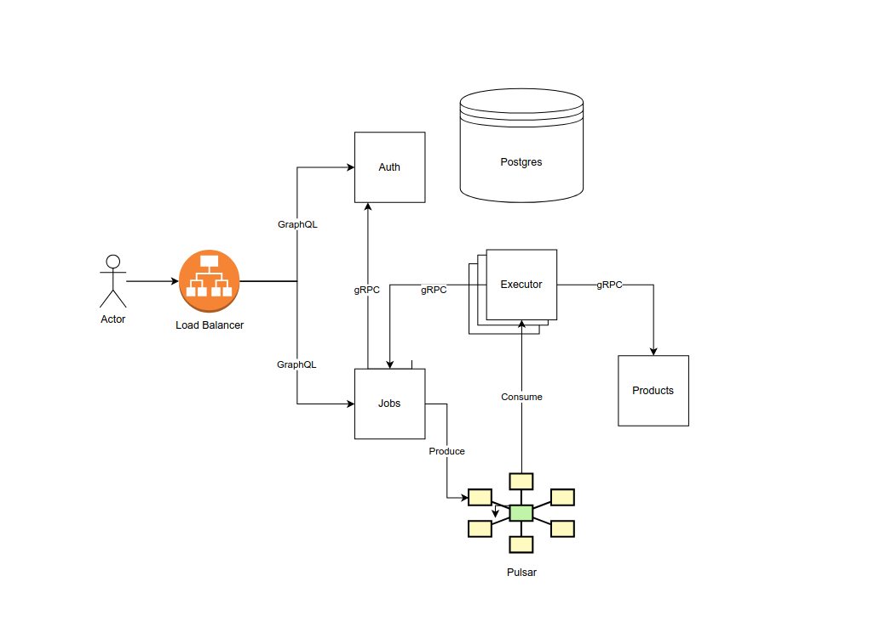

# Jobber

A production-ready distributed job engine built with NestJS microservices, designed for scalability, reliability, and high-performance background processing.

This project demonstrates how to architect a modern backend system using event-driven microservices, message queues, gRPC communication, and containerized deployment.

- [Technologies](#technologies)
- [Features](#features)
- [Architecture](#architecture)

## 🔧 Technologies

- **Backend Framework**: NestJS
- **Communication**: gRPC, REST, WebSocket
- **Messaging**: Apache Pulsar / Kafka
- **Database**: PostgreSQL (Prisma / Drizzle ORM)
- **Deployment**: Docker, Kubernetes, AWS
- **Authentication & Security**: JWT, HTTP-only cookies
- **Monitoring & Logging**: Prometheus, Grafana, Winston

## 🚀 Features

- ⚡ **Microservices Architecture** – independently deployable services
- 📩 **Distributed Job Scheduling** – producer/worker model with retries
- 🔄 **gRPC for High Performance** – low-latency service-to-service calls
- 📡 **Event-driven Messaging** – scalable job event processing
- 🔐 **Secure Authentication** – JWT tokens with cookie storage
- 🐳 **Containerized Services** – ready for local and cloud deployment
- ☸️ **Kubernetes Manifests** – production-ready scaling

## 🏗️ Architecture

